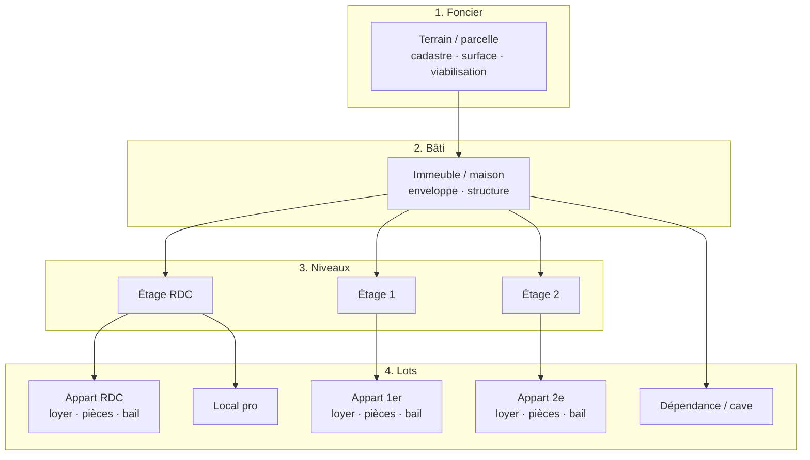

# Schéma de composition immo (multi-niveaux)

## Synthèse

Un dossier « complexe / immeuble » n’est plus une fiche plate : c’est un **arbre**.  
Chaque nœud (terrain, immeuble, étage, appart…) a :

1. sa **propre barre noire** (identité, loyers, pièces, bail, médias) ;
2. un **rattachement** `parent_id` vers le niveau au-dessus ;
3. des **totaux remontés** (loyers réel / prévisionnel, pièces, baux) au niveau global et par branche.



## Niveaux métier

| Niveau | Type unité | Infos typiques | Agrégats utiles |
|--------|------------|----------------|-----------------|
| Terrain | `terrain` | cadastre, surface foncière, PLU | surface |
| Immeuble / maison | `immeuble`, `maison` | enveloppe, année, structure | Σ lots, Σ loyers |
| Étage | `etage` | niveau, parties communes étage | Σ lots de l’étage |
| Appartement / local | `appartement`, `local` | loyer réel/prévisionnel, pièces, bail | point de détail |
| Dépendance | `dependance` | cave, garage, local technique | surface / médias |

## Flux UI

1. **Composition** → synthèse + totaux globaux + **schéma arborescent**
2. Clic **Fiche (barre noire)** sur un nœud → sidebar noire scoped à ce nœud
3. Saisie loyers / pièces / bail au niveau lot → totaux recalculés à la remontée

## Exemple chiffré (preset immeuble)

```
Terrain 420 m²
└─ Immeuble A 280 m²
   ├─ RDC
   │  └─ Apt 1 — loyer réel 580 € · 2 pcs / 1 ch
   ├─ 1er
   │  └─ Apt 2 — loyer réel 640 € · 3 pcs / 2 ch
   ├─ 2e
   │  └─ Apt 3 — prévisionnel 720 € · 3 pcs / 2 ch
   └─ Cave 12 m²
```

**Totaux globaux attendus** : loyers réels 1 220 € · prévisionnels 2 020 € · 8 pièces · 5 chambres · 2 baux actifs.

## API lib (`crm-immo-dossier-lib.js`)

- `buildCompositionTree(units)` — arbre parent→enfants
- `subtreeTotals(units, rootId, includeRoot)` — totaux d’une branche
- `unitTotals(units)` — totaux globaux (loyers HC/CC, Carrez, pièces, baux)
- `COMPOSITION_LEVELS` — rôles métier (foncier / bâti / niveau / lot / annexe)
- `ROOM_TYPES` / `ROOM_ATTRS` — catalogue pièces + attributs (cheminée, balcon, véranda, plateau nu…)

## Barre noire d’un lot (`UNIT_SECTIONS`)

| Section | Contenu |
|---------|---------|
| Identité | type, **cadastre** (section/n°/réf/lieu-dit/contenance — aussi en Localisation & Mandat), digicode lot, lot propriété, millièmes, occupation |
| Loyers & surfaces | mode HC/CC, loyer HC, loyer CC, charges, Carrez / hors Carrez / utile |
| Chauffage & annexes | type/énergie, PAC, chaudière, cheminée, mezzanine, balcon, terrasse, véranda, plateau nu, digicode, n° porte / parking / garage… |
| Pièces | liste libre + attributs par pièce |
| Bail & locataire | identité locataire, revenus, garant, type/dates de bail |
| Investisseur | rendements brut/net, cash-flow, vacance, taxe foncière, PNO, gestion |
| Syndic & copro | syndic, charges, fonds travaux, travaux, procédures |
| Propriétaire | coordonnées, régime matrimonial, origine (achat/donation/héritage…), notaire |
| Photos & visite | médias du lot |

### Cadastre multi-endroits (volontaire)

Les champs cadastraux sont saisisibles :
- **Localisation** (fiche) — `section_cadastrale`, `numero_cadastre`, …
- **Mandat** (mêmes clés)
- **Composition → Identité du lot** — `cadastre_section`, `cadastre_numero`, …

Ce n’est **pas** un doublon de stockage parasite : chaque lot peut avoir sa propre réf. ; à la création d’un lot, les valeurs fiche (Localisation) **préremplissent** le lot si vide (`seedUnitCadastreFromProperty`), sans écraser une saisie existante.

Sur la **vue Composition**, le cadastre immeuble (Localisation/Mandat) est rappelé en bandeau, et chaque nœud affiche sa réf. lot quand elle est renseignée.

## Variantes courantes

- **Maison sur terrain** : terrain → maison → (évent. dépendances) — pas d’étages
- **Complexe** : terrain → plusieurs bâtis → lots
- **Copro simple** : immeuble → appartements (étages optionnels)
