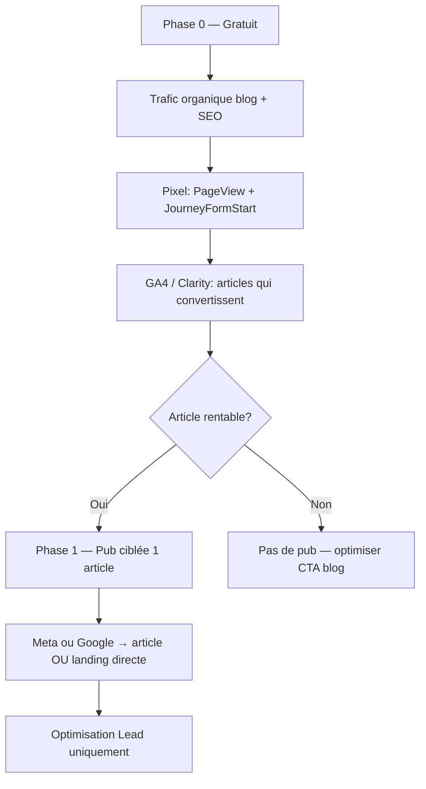

# Acquisition blog → conversion (sans budget test)

Stratégie pour **ne pas brûler d’argent en test pub** : valider le pixel gratuitement, puis ne payer que sur des **articles qui convertissent déjà** via le blog organique.

---

## Principe



| Phase | Budget pub | Objectif |
|-------|------------|----------|
| **0** | **0 €** | Pixel actif, mesurer quels articles mènent au formulaire |
| **1** | **1 €/jour max** | **1 campagne, 1 annonce**, vertical déjà performant |
| **2** | Scale progressif | Dupliquer ce qui a généré des **Lead** qualifiés |

**Règle d’or :** pas de campagne « test ». Chaque euro doit viser une **conversion Lead**, pas de la notoriété.

---

## Phase 0 — Gratuit (maintenant)

### Valider le pixel sans payer

1. Visitez vos landings et articles (vous + proches en France)
2. Acceptez les cookies → Events Manager doit montrer `PageView`
3. Commencez un formulaire (sans soumettre) → `JourneyFormStart`
4. Partagez 2–3 articles sur vos réseaux (LinkedIn, Facebook page, WhatsApp pro)

Articles prioritaires à partager organiquement :

| Article | Pourquoi |
|---------|----------|
| `/blog/mutuelle-sante-5-criteres.html` | Intent mutuelle large |
| `/blog/assurance-vtc-moins-cher-2026.html` | VTC = meilleur CPL historique |
| `/blog/assurance-emprunteur-loi-lemoine-2026.html` | Fort intent économies |
| `/blog/inflation-mutuelle-hausse-2026.html` | Actu FR, angle comparatif |

Pour alimenter regulierement de nouveaux articles orientes leads sans attendre
une actualite forte, le workflow **Blog leads auto** publie 3x/semaine depuis
`data/blog-lead-article-plan.json` :

```bash
npm run blog:leads:auto -- --dry-run
```

Tracking dedie : `utm_medium=lead_evergreen`.

### Mesurer (GA4 / Clarity)

Filtrer les sessions avec :
- `utm_source=blog` ou landing depuis `/blog/`
- Événements `JourneyFormStart`, `Lead`, `qualified_lead`

**Ne lancez aucune pub** tant qu’aucun article n’a au moins quelques `JourneyFormStart` organiques sur 2–4 semaines.

---

## Phase 1 — Pub intelligente (quand vous payez)

### Deux formats selon l’intention

| Intention | URL pub | Quand l’utiliser |
|-----------|---------|------------------|
| **Chaud** (prêt à devis) | Landing directe (`/landings/sante.html`, `/landings/devis-rapide.html`) | Google Search, retargeting visiteurs formulaire |
| **Tiède** (se renseigne) | **Article blog** + CTA bridge | Meta / Demand Gen — l’article éduque, le bridge convertit |

Le blog **ne remplace pas** la landing pour l’intent chaud. Il **réduit le CPC perçu** sur Meta en apportant de la valeur avant le CTA.

### Fichiers campagnes prêts

| Fichier | Plateforme |
|---------|------------|
| `ads/meta-blog-conversions.csv` | Meta — articles + landings directes |
| `ads/google-ads-editor-ready-utm.csv` | Google Search — landings chaudes (existant) |

---

## Meta — structure minimale (budget maîtrisé)

**Ne pas utiliser Automated Ads** pour l’instant (trop automatique, peu contrôlable à petit budget).

### Campagne 1 (quand prêt) — 1 seul vertical, 1 seule annonce

- **Objectif :** Conversions → **Lead**
- **Budget :** **1 €/jour max** (plafond global compte — ne pas multiplier les pubs)
- **Ciblage :** France, Français, **intérêts assurance / immobilier / VTC** selon vertical
- **Créatif :** accroche article + « Devis gratuit en 3 min »
- **URL :** article blog avec UTM (voir CSV) **ou** formulaire Lead Ads — pas les deux en parallèle

Exemple mutuelle :

```text
https://www.leadsopportunities.fr/blog/mutuelle-sante-5-criteres.html?utm_source=meta&utm_medium=paid_social&utm_campaign=sante_blog_convert&utm_content=mutuelle-5-criteres
```

Le lecteur clique le bouton bridge → landing mutuelle **en gardant** `utm_source=meta` (pas écrasé).

### Retargeting (plus tard)

Audience : visiteurs 7 jours avec `JourneyFormStart` **sans** `Lead`  
→ Pub vers `/landings/devis-express.html?need=…` (rappel 30 sec)

**Ne pas activer tant que la campagne principale (1 €/jour) n’est pas validée** — pas de budget supplémentaire ni de deuxième annonce.

---

## Google — priorité Search chaud (existant)

Le CSV `google-ads-editor-ready-utm.csv` envoie déjà vers les **landings**, pas le blog — c’est correct pour Search.

**Activer une campagne à la fois** (VTC déjà Enabled) ; n’activer Santé/Crédit que quand VTC est rentable.

Articles blog = plutôt **Demand Gen / Display** plus tard, pas Search.

---

## Top articles → conversion (priorité pub)

| Priorité | Article | Vertical | Landing conversion | Campagne UTM |
|----------|---------|----------|---------------------|--------------|
| 1 | `vtc-premiere-course-checklist-assurance.html` | VTC | `/landings/devis-rapide.html` | `vtc_blog_convert` |
| 2 | `assurance-vtc-moins-cher-2026.html` | VTC | `/landings/vtc.html` | `vtc_blog_convert` |
| 3 | `mutuelle-sante-5-criteres.html` | Mutuelle | `/landings/sante.html` | `sante_blog_convert` |
| 4 | `questionnaire-mutuelle-quel-niveau-choisir.html` | Mutuelle | `/landings/questionnaire.html?need=sante` | `sante_blog_convert` |
| 5 | `inflation-mutuelle-hausse-2026.html` | Mutuelle | `/landings/sante.html` | `sante_blog_convert` |
| 6 | `assurance-emprunteur-loi-lemoine-2026.html` | Emprunteur | `/landings/credit-immo.html` | `credit_blog_convert` |
| 7 | `assurance-habitation-locataire-proprietaire-2026.html` | Habitation | `/landings/devis.html?need=habitation` | `habitation_blog_convert` |
| 8 | `assurance-auto-jeune-conducteur-2026.html` | Auto | `/landings/devis.html?need=auto` | `auto_blog_convert` |

Détails complets : `ads/meta-blog-conversions.csv`

---

## Règles budget minimal

1. **0 €** tant que le pixel n’a pas 50+ PageView organiques
2. **1 campagne active** maximum — **1 annonce active** maximum
3. **1 €/jour max** pour toute la pub Meta (plafond compte)
4. **Couper** si CPL > 25 € après 5 clics sans Lead
5. **Scale** uniquement sur `qualified_lead` (score ≥ 50) — et seulement après validation CPL à 1 €/jour
6. Articles **actu international / gaming** → jamais en pub (noindex ou hors FR)
7. **Ne pas multiplier** les pubs par vertical, article ou formulaire pour l’instant

---

## Checklist avant la première euro dépensée

- [ ] Pixel `4470774303164658` actif (Events Manager)
- [ ] 2 semaines de trafic blog organique mesuré
- [ ] Article choisi avec le plus de clics bridge (Clarity)
- [ ] UTM copiés depuis `meta-blog-conversions.csv`
- [ ] Objectif campagne = **Lead**, pas Trafic
- [ ] Plafond budget **1 €/jour max** (une seule annonce, pas de campagnes parallèles)
- [ ] Retargeting abandon : **reporté** tant que la campagne unique n’est pas validée

---

## Fichiers liés

- `ads/meta-blog-conversions.csv` — URLs et textes pub
- `ads/google-ads-editor-ready-utm.csv` — Search landings chaudes
- `ads/retargeting-assets.md` — audiences retargeting
- `docs/META-ADS-AUTOMATION.md` — pixel, CAPI, webhook Lead Ads
- `docs/SEA-TRACKING.md` — UTM et événements
