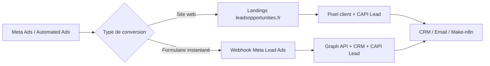

# Meta Ads — automatisation complète

Guide pour connecter **Leads Opportunities** à Meta Ads (compte `997768686183548`, page `1183829618147455`) : pixel, CAPI, formulaires Lead Ads et publicités automatisées.

## Vue d’ensemble



| Canal | Déclencheur | Où ça arrive |
|-------|-------------|--------------|
| Trafic site | Soumission formulaire landing | `POST /api/lead` |
| Lead Ads natif | Formulaire Facebook/Instagram | `POST /api/webhooks/meta-lead` |
| Les deux | Événement **Lead** | Meta CAPI + Events Manager |

---

## Étape 1 — Variables Vercel (obligatoire)

Dans **Vercel → Settings → Environment Variables** :

| Variable | Exemple | Rôle |
|----------|---------|------|
| `META_PIXEL_ID` | `4470774303164658` | Pixel Leads Opportunities (navigateur) |
| `META_CAPI_TOKEN` | token Events Manager | Conversions API (serveur) |
| `META_APP_SECRET` | secret app Facebook | Signature webhook Lead Ads |
| `META_VERIFY_TOKEN` | chaîne aléatoire longue | Vérification webhook GET |
| `META_PAGE_ACCESS_TOKEN` | token page longue durée | Récupérer les leads Graph API |
| `META_PAGE_ID` | `1183829618147455` | Filtrer les webhooks par page |
| `META_CAPI_VERSION` | `v20.0` | Optionnel |

Puis **Redeploy**.

### Contournement si l’UI Vercel ne sauvegarde pas

1. **Import .env** — copier `config/meta-vercel.env.example`, remplir les valeurs, puis Vercel → **Environment Variables** → **Import** → coller le fichier (sans lignes `#`).
2. **GitHub Actions** — ajouter le secret `META_PAGE_ACCESS_TOKEN` dans GitHub → **Settings → Secrets → Actions**, puis lancer le workflow **Meta Lead Ads — créer formulaires** (bouton *Run workflow*).
3. **CLI** (si token Vercel) : `npx vercel env add META_VERIFY_TOKEN production` puis coller `lo-meta-webhook-2026`.

`META_VERIFY_TOKEN` = chaîne inventée (ex. `lo-meta-webhook-2026`) — **pas** une clé Stripe `sk_live_...`.

Référence locale : `.env.example` et `CONNECT.md`.

---

## Étape 2 — Pixel + CAPI (site web)

Le site charge automatiquement le pixel via `google-config.js` si `META_PIXEL_ID` est défini.

### Événements envoyés

| Événement | Moment | Optimisation Ads |
|-----------|--------|------------------|
| `PageView` | Chaque page | Audiences |
| `JourneyFormStart` | Début formulaire | Retargeting abandon |
| `JourneyStep` | Étapes wizard | Analyse entonnoir |
| `Lead` | Soumission réussie | **Conversion principale** |

CAPI envoie aussi `Lead` côté serveur (email/téléphone hashés, `fbclid`, cookie `_fbp`).

### Vérification

1. Extension [Meta Pixel Helper](https://chrome.google.com/webstore/detail/meta-pixel-helper)
2. Events Manager → **Test events** → ouvrir une landing avec UTM Meta
3. Remplir un formulaire test → vérifier `Lead` (client + serveur)

URL test :

```text
https://www.leadsopportunities.fr/landings/rappel.html?utm_source=meta&utm_medium=paid_social&utm_campaign=test-automation&utm_content=annonce-1
```

---

## Étape 3 — Webhook Lead Ads (formulaires instantanés)

Endpoint déployé :

```text
https://www.leadsopportunities.fr/api/webhooks/meta-lead
```

### Configuration Facebook App

1. [developers.facebook.com](https://developers.facebook.com) → **Créer une app** (type Business)
2. Ajouter le produit **Webhooks**
3. **Callback URL** : `https://www.leadsopportunities.fr/api/webhooks/meta-lead`
4. **Verify token** : même valeur que `META_VERIFY_TOKEN` sur Vercel
5. S’abonner au champ **leadgen** pour la page `1183829618147455`
6. Générer un **Page Access Token** avec la permission `leads_retrieval`
7. Coller le token dans `META_PAGE_ACCESS_TOKEN` sur Vercel

### Flux automatique

1. L’utilisateur remplit un formulaire instantané Meta
2. Meta envoie un webhook `leadgen` → `/api/webhooks/meta-lead`
3. Le serveur récupère les champs via Graph API
4. Lead inséré en base + CRM + email + CAPI `Lead` (`action_source: system_generated`)

### Mapping des formulaires

**Guide détaillé (questions copy-paste par vertical) :** [META-LEAD-FORMS-SETUP.md](./META-LEAD-FORMS-SETUP.md)

Fichier `config/meta-lead-forms.json` :

```json
{
  "forms": {
    "VOTRE_FORM_ID": {
      "name": "Mutuelle famille",
      "vertical": "sante",
      "campaign": "mutuelle-france-2026",
      "landing": "/landings/sante.html"
    }
  }
}
```

Après création d’un formulaire dans Automated Ads, copiez son **form_id** depuis Events Manager ou la bibliothèque de formulaires et ajoutez-le ici.

---

## Étape 4 — Publicités automatisées (Automated Ads)

URL de création :  
[facebook.com/ad_center/create/automatedads](https://www.facebook.com/ad_center/create/automatedads/?ad_account_id=997768686183548&page_id=1183829618147455)

### Option A — Objectif **Leads** + formulaire instantané (recommandé pour démarrer)

1. Choisir **Obtenir des prospects**
2. Page : celle liée à `1183829618147455`
3. Créer un **formulaire instantané** avec :
   - Prénom + nom (ou nom complet)
   - E-mail
   - Téléphone
   - Case consentement RGPD (« J’accepte d’être contacté par Leads Opportunities »)
4. Ciblage : **France**, langue **Français**
5. Budget quotidien (ex. 10–20 € pour tester)
6. Une fois le formulaire créé → noter le `form_id` → l’ajouter dans `config/meta-lead-forms.json`

Les leads arrivent automatiquement dans le CRM sans action manuelle.

### Option B — Objectif **Trafic** ou **Conversions** vers le site

1. URL de destination :

```text
https://www.leadsopportunities.fr/landings/rappel.html?utm_source=meta&utm_medium=paid_social&utm_campaign=auto-ads-rappel&utm_content={{ad.id}}
```

Landings par produit :

| Produit | URL |
|---------|-----|
| Rappel express | `/landings/rappel.html` |
| Mutuelle | `/landings/sante.html` |
| VTC | `/landings/vtc.html` |
| Crédit immo | `/landings/credit-immo.html` |
| Devis général | `/landings/devis.html?need=auto` |

2. Événement d’optimisation : **Lead** (pas PageView)
3. Le pixel + CAPI du site gèrent le suivi

### Option C — Mix (Automated Ads avancé)

- Annonce 1 : formulaire instantané (Lead Ads webhook)
- Annonce 2 : lien vers landing rappel (pixel site)

Les deux remontent en **Lead** dans Events Manager et alimentent le même CRM.

---

## Étape 5 — Optimisation campagne

1. **Événement principal** : `Lead`
2. **Événement secondaire** : `JourneyFormStart` (retargeting abandon 7–14 jours)
3. **Emplacements** : France uniquement
4. **Exclusions** : audiences Lookalike hors France
5. Après ~50 conversions/mois : passer en **CPA cible** sur `Lead`

Voir aussi `docs/SEO-SEA-FRANCE-CIBLAGE.md` et `docs/SEA-TRACKING.md`.

---

## Étape 6 — Notifications et automatisations externes

| Variable | Effet |
|----------|-------|
| `LEAD_WEBHOOK_URL` | Forward chaque lead vers Make / n8n |
| `LEAD_NOTIFICATION_EMAIL` | Alertes email Resend |
| `RESEND_API_KEY` | Envoi email |

Doc Make/n8n : `docs/automation-make-n8n.md`.

---

## Checklist de mise en production

- [ ] `META_PIXEL_ID` + `META_CAPI_TOKEN` sur Vercel
- [ ] Redeploy → Pixel Helper voit `PageView` sur le site
- [ ] Test formulaire site → `Lead` dans Events Manager
- [ ] App Facebook + webhook `leadgen` configuré
- [ ] `META_APP_SECRET`, `META_VERIFY_TOKEN`, `META_PAGE_ACCESS_TOKEN` sur Vercel
- [ ] Test Lead Ads → lead visible dans CRM (`source: meta_lead_ads`)
- [ ] `form_id` ajouté dans `config/meta-lead-forms.json`
- [ ] Campagne Automated Ads : France, français, optimisation Lead
- [ ] Budget test lancé

---

## Dépannage

| Problème | Solution |
|----------|----------|
| Webhook non vérifié | Vérifier `META_VERIFY_TOKEN` identique côté Meta et Vercel |
| Signature invalide | Vérifier `META_APP_SECRET` |
| Lead Ads sans email | Vérifier les champs obligatoires du formulaire Meta |
| Graph API 403 | Regénérer token page avec `leads_retrieval` |
| Pixel absent | Redeploy après ajout `META_PIXEL_ID` ; accepter cookies |
| CAPI inactive | Vérifier `META_CAPI_TOKEN` dans Events Manager → Diagnostics |

---

## Fichiers code concernés

| Fichier | Rôle |
|---------|------|
| `api/webhooks/meta-lead.js` | Webhook Lead Ads |
| `api/_lib/meta-lead-ads.js` | Graph API + mapping champs |
| `api/_lib/meta-capi.js` | Conversions API |
| `api/_lib/lead-post-ingest.js` | Email, partenaires, CAPI post-insert |
| `config/meta-lead-forms.json` | Mapping form_id → vertical |
| `google-config.js` | Chargement pixel client |
| `js/attribution.js` | fbclid, fbp, parcours Meta |
| `landings/tracking.js` | Événements Lead sur landings |
