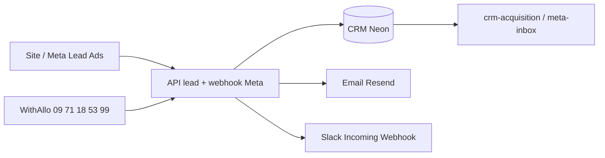

# Slack (gratuit) + WithAllo (plus tard)

Stack recommandée pour les **alertes leads** sans remplacer le CRM Leads Opportunities.

---

## Principe

| Outil | Rôle | Quand |
|-------|------|--------|
| **CRM** (`crm-acquisition.html`, `crm-meta-inbox.html`) | Source de vérité, pipeline, matching VSP | Toujours |
| **Slack gratuit** | Notification instantanée équipe | Maintenant |
| **WithAllo** | Appels, transcriptions, rappels téléphoniques | Quand volume de demandes ↑ |
| **Email Resend** | Copie détaillée (déjà actif si `RESEND_API_KEY`) | Toujours |

Le CRM **décide** (score, priorité, archivage). Slack **alerte**. WithAllo **complète** le canal téléphone.

---

## Phase 1 — Slack (token ou webhook)

Deux options (l’une suffit) :

### A. Token utilisateur / bot (recommandé si vous avez un `xoxp` / `xoxb`)

| Variable | Valeur |
|----------|--------|
| `SLACK_BOT_TOKEN` | Token Slack (`xoxp-…`, `xoxb-…` ou export `xoxe.xoxp-1-…`) |
| `SLACK_CHANNEL` | Canal, ex. `leads` (défaut). **Invitez l’app dans ce canal** sinon `channel_not_found`. |

Le token n’est **jamais** dans le git — uniquement Vercel → Environment Variables.

### B. Incoming Webhook

1. [https://app.slack.com/](https://app.slack.com/) → votre workspace
2. **Apps** → **Incoming Webhooks** (ou créer une app Slack depuis [api.slack.com/apps](https://api.slack.com/apps))
3. Choisir le canal (ex. `#leads` ou `#alertes-courtier`)
4. Copier l’URL du type :  
   `https://hooks.slack.com/services/T…/B…/…`

| Variable | Valeur |
|----------|--------|
| `SLACK_WEBHOOK_URL` | URL Incoming Webhook **complète** (`https://hooks.slack.com/services/T…/B…/…`). Un hash / signing secret seul fait échouer `fetch`. |

**Redeploy** Vercel.

### 3. Ce qui est notifié

Chaque lead (site, **Meta Lead Ads**, etc.) déclenche un message Slack :

- vertical, score, source
- téléphone / email si présents
- campagne UTM si présente
- lien direct CRM (Meta inbox ou pipeline)

Implémentation : `api/_lib/lead-post-ingest.js` → `notifySlack()`.

### Limites Slack gratuit

- Historique messages limité (90 jours sur plan free)
- Pas de workflow avancé — suffisant pour **« nouveau lead → ouvrir CRM »**
- Pour scénarios complexes (J+1 relance auto), voir Make/n8n plus tard (`LEAD_WEBHOOK_URL`)

---

## Phase 2 — WithAllo (actif — numéro temporaire)

Site WithAllo : [https://web.withallo.com/](https://web.withallo.com/)

### Ligne téléphonique publique (temporaire)

| Champ | Valeur |
|-------|--------|
| **Numéro Allo (ligne active)** | **09 71 18 53 99** (`tel:+33971185399`) |
| Statut | Temporaire WithAllo — affiché sur le site / NAP / schema.org |
| Portage en cours | `06 95 82 08 66` et `06 51 36 62 22` (Allo → « En cours ») |
| Config | `config/tenant-brand.json` · `config/quote-brand.json` |

Quand le portage est terminé : remettre le mobile définitif partout (agence Varangéville, nancy-54, JSON-LD accueil) et mettre à jour GBP.

### Déjà câblé dans le projet

| Élément | Détail |
|---------|--------|
| Webhook entrant | `POST https://www.leadsopportunities.fr/api/webhooks/withallo` |
| Secret | `WITHALLO_WEBHOOK_SECRET` sur Vercel |
| Header | `Authorization: Bearer {WITHALLO_WEBHOOK_SECRET}` |
| CRM | Source `withallo` dans pipeline + dashboard |
| Matching VSP | `crm-private-offer-matching.html` reconnaît `withallo` |

### Configuration WithAllo

1. Générer un secret fort → Vercel `WITHALLO_WEBHOOK_SECRET`
2. Dans WithAllo : webhook vers l’URL ci-dessus
3. **Redeploy** Vercel
4. Les événements Allo (appels, leads) arrivent dans le **même CRM** que Meta et le site

Doc technique : `docs/automation-make-n8n.md` (section WithAllo), `docs/CRM-AUTOMATIONS.md`.

---

## Schéma

---

## Variables Vercel — récap

| Variable | Phase | Obligatoire |
|----------|-------|-------------|
| `SLACK_BOT_TOKEN` | Slack | Recommandé (token xoxp / xoxb) |
| `SLACK_CHANNEL` | Slack | Optionnel (défaut `leads`) |
| `SLACK_WEBHOOK_URL` | Slack | Alternative au token |
| `RESEND_API_KEY` + `LEAD_NOTIFICATION_EMAIL` | Email | Recommandé |
| `WITHALLO_WEBHOOK_SECRET` | WithAllo | Quand WithAllo actif |
| `LEAD_WEBHOOK_URL` | Make/n8n | Optionnel (scénarios avancés) |

---

## Test Slack

1. Soumettre un formulaire test sur une landing **ou** un lead test Meta
2. Vérifier le canal Slack `#leads` (ou celui choisi)
3. Cliquer le lien **Ouvrir le CRM** dans le message

Pas de Slack reçu → vérifier `SLACK_WEBHOOK_URL` + redeploy.

### Alerte baisse de trafic (automatique)

Cron Vercel **8h** (`/api/mailbox/cron-sync`) → sync mailbox + ping SEO + alerte trafic Slack (avec `CRON_SECRET`).
Endpoint manuel compat : `GET /api/cron/traffic-alert`.

| Variable | Défaut | Rôle |
|----------|--------|------|
| `TRAFFIC_ALERT_THRESHOLD_PCT` | `-20` | Alerte si visiteurs 7j ↓ de plus de 20 % vs semaine préc. |
| `TRAFFIC_ALERT_MIN_VISITORS` | `5` | Ignore si semaine préc. &lt; 5 visiteurs (bruit) |
| `TRAFFIC_ALERT_COOLDOWN_HOURS` | `24` | Max 1 alerte / 24 h |
| `TRAFFIC_ALERT_ENABLED` | `true` | `false` pour désactiver |

Test manuel : **crm-trafic.html** → « Vérifier maintenant » ou « Forcer alerte Slack ».
