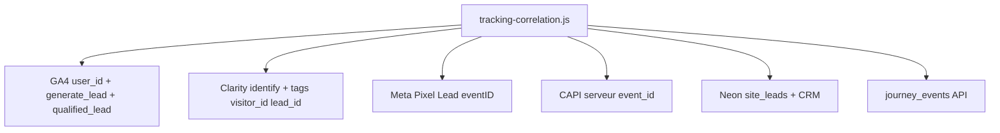

# Suivi corrélé — GA4, Clarity, Search Console, Meta, CRM

Objectif : **un même fil conducteur** (`visitor_id` → `lead_id` → `utm_campaign`) dans tous les outils, pour savoir ce qui rapporte vraiment.

---

## Clé de corrélation

| ID | Où | Rôle |
|----|-----|------|
| `visitor_id` | localStorage `lo_vid_v1` | Visiteur anonyme (GA4 `user_id`, Clarity `identify`) |
| `lead_id` / `transaction_id` | Réponse `POST /api/lead` | Conversion unique (GA4, Meta `eventID`, CAPI, CRM) |
| `utm_campaign` | URL + attribution | Campagne pub / blog / SEO |
| `parcours_id` | `js/attribution.js` | meta_lead_rapide, google_intention_chaude, organique_confiance |

Fichier central : **`js/tracking-correlation.js`** (chargé via `google-config.js`).

---

## Où chaque outil reçoit quoi

| Outil | Identité | Conversions | Acquisition |
|-------|----------|-------------|-------------|
| **GA4** | `user_id` = visitor_id | `generate_lead`, `qualified_lead`, `journey_*` | UTMs en params d'événement |
| **Clarity** | `identify(visitor_id)` | `lead_converted`, tags `lead_id`, `lead_score` | Filtre `market_intent=FR`, `utm_*` |
| **Search Console** | Pages / requêtes | *Indirect* via landing pages | Lier GSC ↔ GA4 (Admin) |
| **Meta** | `fbclid`, `_fbp` | `Lead` + CAPI dédupliqués (`eventID` = lead_id) | Events Manager |
| **CRM** | email + visitor_id | `site_leads`, `crm_contacts` | `utm_*`, `platform`, score |

---

## Événements GA4 (canoniques)

| Événement | Quand |
|-----------|--------|
| `generate_lead` | Lead enregistré avec succès (1 seule fois) |
| `qualified_lead` | Score serveur ≥ 50 |
| `journey_form_start` | Début formulaire (miroir journey API) |
| `journey_form_abandon` | Quitte sans soumettre |
| `journey_lead_success` | Succès parcours |
| `wizard_step` | Étape wizard landing |
| `audience_geo_check` | Geo France (geo-france-guard) |
| Blog | `blog_article_view`, `blog_cta_click`, `blog_scroll_depth` |

**Important :** les conversions Google Ads ne partent qu’**après succès API**, plus au clic « Envoyer ».

---

## Configuration GA4 (Admin — une fois)

1. **Admin → Affichage des données → Définitions personnalisées → Dimensions personnalisées**
   - `visitor_id` (portée : événement)
   - `utm_campaign` (portée : événement)
   - `vertical` (portée : événement)
   - `lead_id` (portée : événement)

2. **Admin → Liaisons produits**
   - Lier **Google Ads**
   - Lier **Search Console** → voir requêtes organiques + pages qui convertissent

3. **Exploration recommandée « ROI campagnes »**
   - Dimensions : `utm_campaign`, `landing_path`, `Page title`
   - Métriques : `generate_lead`, `qualified_lead`
   - Filtre : `in_france_audience = yes`

---

## Microsoft Clarity

### Filtres utiles

| Filtre | Valeur |
|--------|--------|
| Tag | `market_intent` = `FR` |
| Tag | `visitor_id` = (coller depuis CRM) |
| Tag | `lead_id` = (coller après conversion) |
| Tag | `utm_campaign` = nom campagne |

### Retrouver une session depuis un lead CRM

1. CRM → lead → copier `visitor_id` ou `lead_id` du payload JSON
2. Clarity → Filtres → tag `visitor_id` ou `lead_id`
3. Voir le replay : d’où vient le visiteur, où il abandonne

Doc détaillée : **`docs/CLARITY-DIAGNOSTICS.md`**

---

## Search Console

Pas d’API dans le code — corrélation **via GA4** :

1. [Search Console](https://search.google.com/search-console) → propriété `https://www.leadsopportunities.fr/`
2. GA4 → Admin → **Associations Search Console**
3. Rapport GA4 : **Acquisition Google Search Console** + croiser avec `generate_lead`

Pages blog indexées → trafic organique → bridge CTA → `generate_lead` avec `utm_source=blog` si pas d’UTM payant.

---

## Meta (Pixel + CAPI)

- Client : `Lead` avec `eventID` = `lead_id`
- Serveur : CAPI `Lead` avec même `event_id`
- Params : `fbclid`, `_fbp`, email/tél hashés

Doc : **`docs/META-ADS-AUTOMATION.md`**

---

## CRM & compta ROI

- Chaque lead : `utm_source`, `utm_medium`, `utm_campaign`, `visitor_id`, `lead_score`
- Dépenses pub : catégorie `ads` dans `pro_expenses`
- ROI : `docs/COMPTA-REGLES.md` — lier `utm_campaign` des leads signés aux dépenses du mois

Export : `GET /api/crm/pro-accounting?action=export&month=YYYY-MM`

---

## Checklist mise en prod

- [ ] `GA4_MEASUREMENT_ID` sur Vercel
- [ ] Dimensions custom GA4 créées (visitor_id, utm_campaign, lead_id)
- [ ] Search Console liée à GA4
- [ ] Google Ads lié à GA4 + conversions `generate_lead` / `qualified_lead`
- [ ] Clarity projet `CLARITY_PROJECT_ID` actif
- [ ] `META_PIXEL_ID` + `META_CAPI_TOKEN`
- [ ] Test : soumettre formulaire test → vérifier GA4 DebugView + Clarity tag `lead_id`

---

## Fichiers code

| Fichier | Rôle |
|---------|------|
| `js/tracking-correlation.js` | Hub corrélation |
| `js/attribution.js` | visitor_id, UTMs, journey API |
| `js/clarity-source.mjs` | Tags Clarity + identify |
| `landings/tracking.js` | Formulaires landings |
| `js/callback-form.js` | Rappel express |
| `api/_lib/lead-post-ingest.js` | CAPI post-lead |
| `docs/SEA-TRACKING.md` | UTM et env vars |
